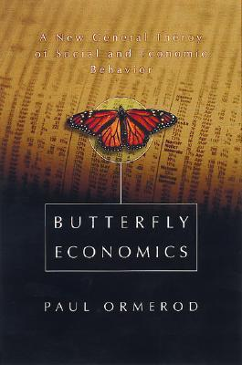
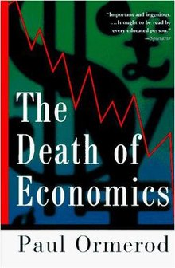

## Welcome to Economics and Finance Reading Reviews

Below are the books that have been instrumental in guiding my thought process in terms of viewing finance and economics through a complex adaptive system (CAS) lense. The books are either a direct reference to a CAS or argue successfully that the neo-classical paradigm is flawed.

## The Origin of Wealth

This book is a great starting point in understanding the importance of considering the economy as a CAS. Beinhocker outlines how physical technologies, social technologies, and business designs continuously interact to create novel products, new ideas, and increasing wealth. In doing this he provides a rich history of economics, and where it has managed to fall short. Along the way you are introduced to many of the people and concepts outlined on my website. The only negative is the last chapter or so where the book digresses from “pure economic” concepts.

## Complexity and the Econonmy

Unlike popularized books, such as Mis(behaving) and Superforecasting, this book is more or less a collection of Brian Arthur’s life’s work. The downside being it is a “slightly” heavier read but the upside is that you are exposed to the evolution of complexity economics. Therefore, it may be best to start with Origins or the Death of Economics before reading this book.

The basis of all the papers are that the economy is always in process, always changing and people try to make sense of the situations they face using whatever reasoning they have at hand, and together create outcomes they must individually. This contrasted to the standard view where people are assumed to face well-defined problems and use perfect deductive reasoning to base their actions on. The paper cover topics as disparate as how markets form out of beliefs; how technology evolves over the long span of time; why systems and bureaucracies get more complicated as they evolve; and how financial crises can be foreseen and prevented in the future.

## An Engine not a Camera
{: width="350px"}.

The title comes from MacKenzie paraphrasing Milton Friedman in saying that economic models are an engine of inquiry rather than a camera to reproduce empirical facts. This theme is explored through how the emergence of modern economic theories of finance affected financial markets in fundamental ways, that is many of the theories became intrinsic parts of economic processes. The ramifications are illustrated by the role of portfolio insurance in the stock market crash of 1987, and the market turmoil that engulfed the hedge fund Long-Term Capital Management in 1998. 

The book also provides a great history of how the various theories became established. Additionally, the readers are exposed to some of concepts that relate to financial markets being a complex system.

## The Myth of the Rational Market

While this book covers similar ground as, _An Engine Not a Camera_, and _Forecast_, it is it is still well worth the read. It is certainly a lighter read but that is not to stay it does not provide valuable insights, and eloquently details the rise and fall of the EMH. While Fox admits that he did not set out with any prejudice or against the EMH, he does a convincing job of exposing it flaws. The key point of differentiation of the book is how it brings to life the people and ideas of modern finance starting with the formative days of Wall Street through the Great Depression and into today’s financial markets.

## Misbehaving

With Thaler finally (and deservedly) winning the Nobel Memorial Prize in Economic Sciences there is no argument that this book is essential reading. Thaler does an excellent job of translating his academic work into everyday terms, so the reader can easily comprehend the importance, and relevance of his work. The essence of his work being that humans are error-prone, and do not act in accordance with rational expectations doctrine of neo-classical economics. The consequences of this “misbehaving” for individuals, policymakers, and the economy is what the book details. Importantly, Thaler also enlightens readers about how to make smarter decisions and avoid the numerous biases that result in the misbehavior.

## Forecast

It is one thing to throw stones at the modern-day economics, but it’s another to propose an acceptable alternative. In his thought provoking book Buchanan achieves the later. 

Buchanan firstly makes the argument that the economy does not operate in the manner as prescribed by classical economics but works more like our atmosphere, which is to say - a loose surface trying to balance itself against continually fluctuations. Then leaning on the concept of positive feedback mechanisms, which have been largely ignored in modern economics due to strong belief in markets finding and staying in equilibrium, a new approach to economics, including the integration of complex system theory is proposed. Well worth the read.

## The Mis(behavior) of Markets

GDiuqgwefi

## Superforecasting
{: width="350px"}.

If I was to only recommend one book, then this it. After reading this book you will never listen to expert in the same way again! And more importantly you will change your approach to assessing things. You will also learn what it really means when someone tells you that Donald Trump has a 33% of winning an election.

The attraction of the book is that Tetlock, and coauthor Gardner, take now familiar road of popularizing academic research to enlighten non-subject matter experts. The book draws on decades of research and the results of the Good Judgment Project, which showed that people tend to be poor forecasters. However, all is not lost and with the authors detailing  how you can become a good forecaster. 

## Why Stock Markets Crash 

In a similar vein to Buchanan’s Forecast, Sornette firstly outlines the case against the incumbent theories before proposing a general theory of how, why, and when stock markets crash. He makes the strong point that most explanations other than cooperative self-organization fail to account for the subtle bubbles which are ultimately responsible for market crashes. The proposed theory borrows much from complex systems, and suggests that the underlying cause can be identified months and even years before a bubble appears. Beware that this book is a heavier read than most.

## The First Crash

You would think that people would learn but the after reading this book it is clear they do not. The events surrounding the South Sea Bubble, including: the trading techniques (which included 'modern' transactions such as derivatives); the use of new data; and the neglected writings of financial analyst are deatiled in this great book. In delivering a concise and well researched history of the bubble the book provides key insights into the nature of financial markets, and the reasons why asset bubbles continue to come and go.  

## Butterfly Economics
{: width="350px"}.

## The Death of Economics
{: width="350px"}.
