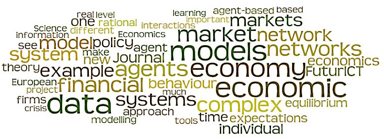

# Complexity Economics


_"It is wiser to find out than to suppose"_ - Mark Twain 



### Background
My initial questioning of neo-classical economics started after spending most of my microeconomics honors class working through the proofs as to why a demand curve slopes downwards (well at least in most classes). Apart from the fact that undergraduate and business school students sail off into business without understanding this work, many of the assumptions pertaining to the rational representative seemed onerous and unlikely to be within the grasp of the standard consumer. Unbeknown to me at the time, Simon (1955) had already questioned whether humans possessed these capabilities, and offered the alternative of human’s acting with bounded rationality. 

The first line of defense against these queries has always been to cite Friedman’s doctrine on positive economics, with the implication being to assume consumers act “as if” they were performing these calculations. Also, successfully arguing that economics should be the study of “what is” rather than “what ought to be”.  Friedman’s argument laid the foundation for the rational expectation phenomena that underwrote most of the mainstream economic theory of the latter half of the 20th century.

Again, unbeknown to me at the time, objections to the representative agent were gathering stream, with Kirman (1992), stating that the utilization of a representative agent is a “convenient fiction,” used to provide micro foundations for aggregate behavior with the sole intent of solving for stable and unique equilibria. Kirman also provided the impetus to consider the economy as a complex system, capable of delivering emergent outcomes, when he made the point that “the sum of the behavior of simple economically plausible individuals may generate complicated dynamics.”

After re-commencing my research into the drivers of innovation I came across The Origins of Wealth which opened my eyes to the growing field of complexity economics (i.e., the economy operates as a complex system), which addresses many of my concerns relating to the rational expectations approach. The essence of complexity economics is to assume that the economy is not in equilibrium, but is, in perpetually motion as economic agents (firms, consumers, investors) constantly change their actions and strategies in response to the outcome they mutually create. In turn, with a lack of a stable equilibrium, the use of static analytical frameworks becomes problematic. However, with an ABM, the dynamics of the economy can be revealed, as they are not constrained by equilibrium conditions and they allow for the interaction of agents within a system. 

 Rather than bog everyone down with the inner workings of complexity economics, I provide a link to a paper by the godfather of complexity economics, Brian Arthur (a review of his book is also provided in the book review section, and an [interview](https://www.complexityexplorer.org/news/19-w-brian-arthur-on-complexity-economics). A good explanation of complexity economics can be found at this [website](https://www.exploringeconomics.org/en/orientation/complexity-economics/).   
Consideration of the economy as a complex system has gathered considerable steam, and covers most topics in economics including: macro, innovation, finance etc, with the intent being to study how non-intuitive results at the macro-level of a system can emerge from simple interactions at the micro level. Some of the more interesting outcome for have been path-dependence, increasing returns to scale and inductive reasoning, as opposed to the rational agent models that employ deductive reasoning.

As mentioned previously the use of ABMs has been the primary analytical tool utilized to research the economy as a complex system. The website of [Leigh Tesfatsion](http://www2.econ.iastate.edu/tesfatsi/ace.htm) is a great resource, while the Handbook of Computational Economics Volume 2, while now a little dated, is an excellent resource

### My Interest
The utilization of complexity economics for the goal of understanding the process of innovation is on great interest for me, and in particular the process of “creative destruction” (Schumpeter, 1942). There is extensive research and theory relating to the way firms interact with other firms. However, the evolutionary aspect of these relationships remains outside the mainstream of economic research. While there are many parts to the evolutionary process, my interest has been in Red Queen hypothesis (Van Valen, 1973). My first paper on the subject can be found here

The process of “creative destruction” involves any existing market structure being “destroyed” because of the successful innovation of a firm, with its significance being that it explains why firms are motivated to undertake new “actions” to either improve their position or retain their position in response to the actions of their competitors.  The ramification is that the system is in a perpetual state of change, making it vital to understand the dynamics involved in the process of innovation.  

The original hypothesis, as proposed by Van Valen (1973), was focused on evolutionary biology, with the key implication stating that due to the continuous and escalating actions of competitors within an ecosystem, organisms must continually evolve if they wish to survive. The direct relevance to the innovative policy of a firm is that its performance will depend on its ability to successfully react to the actions of its competitors. 

### References
```
Arthur, W. B. (2013). Complexity Economics: A Different Framework for Economic Thought. SFI WORKING PAPER, 2013-04–012.

Friedman, M. (1953). The Methodology of Positive Economics. In Essays in Positive Economics (Vol. 3). Chicago, Ill.: University of Chicago Press.

Kirman, A. P. (1992). Whom or What Does the Representative Individual Represent? Journal of Economic Perspectives, 6(2), 117–136. https://doi.org/10.1257/jep.6.2.117

Schumpeter, J. A. (1942). Capitalism, Socialism and Democracy. New York: Harper and Row.

Simon, H. A. (1955). A Behavioral Model of Rational Choice. The Quarterly Journal of Economics, 69(1), 99. https://doi.org/10.2307/1884852

Tesfatsion, L., & Judd, K. L. (Eds.). (2006). Handbook of Computational Economics. Amsterdam Boston: Elsevier.Van Valen, L. (1973). A New Evolutionary Law. Evolutionary Theory, 1, 1–30.

```


