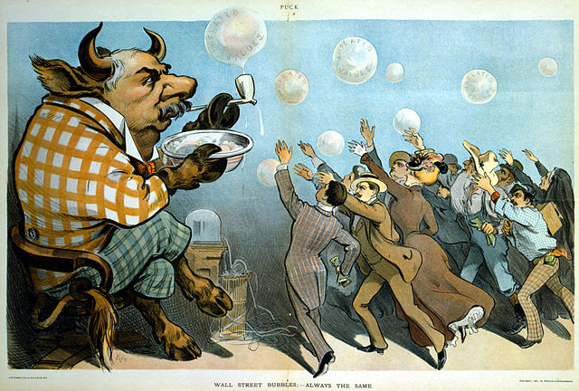
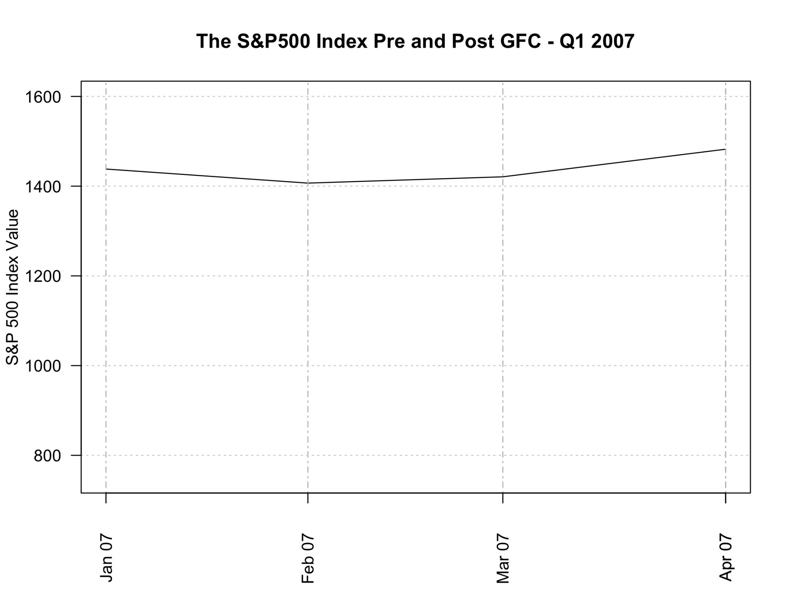

# Finance

_"You can have your own opinions. But you can't have your own facts"_ - Ricky Gervais

The behavior of financial markets has frustrated, and continues to frustrate, investors and academics. The main bone of contention for me is that the Efficient Market Hypothesis (EMH) still underlies much of today's mainstream theory and practices. Despite some empirical support for the EMH, and the models that utilize its assumptions, the reality of continued episodes of extreme volatility, booms, and crashes has led some to consider alternatives. The search for alternatives has gained further impetus following the crash in global markets in 2007, with considering financial markets as a complex adaptive system (CAS) proving to be a credible alternative.

A truer representation of the return characteristics of financial markets, as summarized by [Cont (2007)](papers/Cont 2007.pdf) and [Johnson, Jefferies, & Hui (2003)](https://www.amazon.com/Financial-Market-Complexity-Behaviour-Economics/dp/0198526652), is that they demonstrate: excess volatility – the existence of large movements not supported by the arrival of new news; heavy tails – returns exhibit “heavy tails” or “fat tails” indicating returns deviate more than anticipated and do not follow a Gaussian distribution; volatility clustering – large changes are followed by further large changes; and volume/volatility clustering – trading volumes and volatility show the same type of long memory. In addition, [Mandelbrot (1963)](papers/Mand1963.pdf) first provided evidence that returns may follow a very unique distribution, a  power law distribution, with [Lux and Alfarano (2016)](papers/LuxAlf2016.pdf) providing a detailed review of the empirical evidence supporting the existence of power laws in financial markets. For investors, the main implication of returns following a power law is that the risk of large losses is much higher than suggested by the EMH, and markets are more volatile. It is the existence of power law returns that provides the key insight that financial markets may operate as a complex system.

Johnson, Jefferies and Hui (2003) suggest that for a system to be considered complex, it must contain some, if not all, of the following: feedback, non-stationarity, many interacting agents, adaptation, evolution, single realization, and it must be an open system. This position is consistent with the views of [Sornette (2014)](papers/Sornette2014.pdf), who concluded that to understand stock market returns one must consider: imitation, herding, self-organized co-operativity, and positive feedbacks. [Farmer et al., (2012)](papers/Farmer2012.pdf) concluded that if one considers financial markets as a complex system, then one must accept that their outcomes are the result of an emergent process based on the self-organized behavior of independently acting, self-motivated individuals.

### The S&P 500 2007 - 2010

The above animation plots the course of the S&P 500 as it heads toward, and then recovers from, the Global Financial Crisis (GFC). As mentioned above it was this "unexpected" and "unexplained" collapse that has provided the impetus for the search for alternative analytical frameworks. 

## My contribution
In my recent [journal articles](https://moldham74.github.io/AussieCAS/pub.html), I implemented and reported on an ABM that was able to explain why markets behave in the manner described above. The <a href="http://doi.org/10.1142/S0219525917500072" target="blank">first paper</a> looked into the effect of dividends on the market, while the <a href="http://jasss.soc.surrey.ac.uk/20/4/13.html" target="blank">second paper</a> introduced a model with multiple risky assets. The key feature of the model was the ability of investors to consider the actions of their neighbors in making their investment decisions. The model highlights the importance of considering networks when analyzing the behavior of financial markets. The key implication of considering networks, as both papers report, is that the network topology that the investors form has a material effect on the behavior of the market.  

## Markets and networks
The case for the increasing utilization of network science within a complex system view of the economy comes from the fact that due to the increasing dependency between economic agents, it is becoming increasingly difficult to predict and control the economy. In a more specific application of network science to ̄financial markets, network analysis has been able to explain trading decisions and portfolio performance and networks have been found to exist between investors.

While the complete network configuration between investors may be all but impossible to uncover, a more obvious network is the one formed between investors and companies. This is known as a bipartite network and an example of how the network might behave is illustrated below. Links in the network are formed (removed) as an investor makes an investment (divestment) in a company. There are many implications stemming from the dynamics involved in trading, including how investors are linked by similar holdings, and how they may act in herds.

In my class project for CSS697 - Social Network Analysis, I managed to analyze the actual company x investor network for the S&P 500 and US institutional investors from 2007 to 2010. My findings can be found [here](papers/The quest for living beta.pdf). I presented the [findings](Presentations/NetSci2017.pptx) from the project at the 2nd Workshop on Statistical Physics of Financial and Economic Networks satellite at the <a href="http://netsci2017.net/program/satellites" target="blank">NetSci2017</a> conference. 

The key finding of the paper was that the density of the market moved inline with the index. The changes in the density of the company x investor network through time can be seen in the graph below. An increasing density, is represented by a "darker" graph, and vice versa for a decline in density.

## A great example
I also found this great webpage over at the <a href="http://www.visualcapitalist.com" target="blank">Visual Capitalist</a> which provides a great graphic regarding complexity in financial markets.

Courtesy of: <a href="http://www.visualcapitalist.com">Visual Capitalist</a>

### References
Cont, R. (2007). Volatility Clustering in Financial Markets: Empirical Facts and Agent-Based Models. _In Long Memory in Economics (pp. 289–309)_. Springer Berlin Heidelberg. [https://doi.org/10.1007/978-3-540-34625-8_10](https://doi.org/10.1007/978-3-540-34625-8_10)

Farmer, J. D., Gallegati, M., Hommes, C., Kirman, A., Ormerod, P., Cincotti, S., … Helbing, D. (2012). A complex systems approach to constructing better models for managing financial markets and the economy. _The European Physical Journal Special Topics, 214_(1), 295–324. [https://doi.org/10.1140/epjst/e2012-01696-9](https://doi.org/10.1140/epjst/e2012-01696-9)

Friedman, M. (1953). _The Methodology of Positive Economics. In Essays in positive economics (Vol. 3)_. Chicago, Ill.: University of Chicago Press.

Johnson, N. F., Jefferies, P., & Hui, P. M. (2003). Financial Market Complexity. Oxford ; New York: Oxford University Press.

Lux, T., & Alfarano, S. (2016). Financial Power Laws: Empirical Evidence, Models, and Mechanisms. _Chaos, Solitons & Fractals, 88_, 3–18. [https://doi.org/10.1016/j.chaos.2016.01.020](https://doi.org/10.1016/j.chaos.2016.01.020)

Mandelbrot, B. (1963). The Variation of Certain Speculative Prices. _The Journal of Business, 36_(4), 394. [https://doi.org/10.1086/294632](https://doi.org/10.1086/294632)

Sornette, D. (2014). Physics and financial economics (1776–2014): puzzles, Ising and agent-based models. _Reports on Progress in Physics, 77_(6), 62001. [https://doi.org/10.1088/0034-4885/77/6/062001](https://doi.org/10.1088/0034-4885/77/6/062001)
